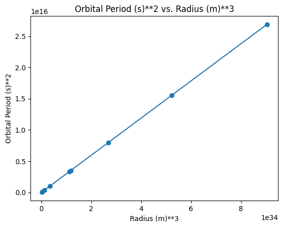

# Investigating Kepler's Third Law

This project uses orbital simulations to investigate the relationship between a planets orbital radius and orbital period. Several circular orbits were used at varying distances from the sun and their resulting periods were recorded and compared with Kepler's Third law.

## Research Question

How does the orbital radius of a planet affect the planets period?

## Hypothesis

I predict the larger the orbital radius the larger the orbital period will be.

## Background

Kepler's Third law allows us to predict the orbital period of a planet given its orbital radius or vice versa. This law states that the orbital radius cubed is directly proportional to the orbital period squared.

## Method

This simulation was preformed using newtonian laws of gravitation along with the euler method of integration using a timestep of one hour. The circular orbital velocities for radii from 0.387 AU to 3.000 AU were calculated. The orbital period was detected after the simulation completed one full orbit and was recorded.

## Results

The simulation showed the orbital period increased as the orbital radius increased supporing my hypothesis. When the orbital radius cubed was ploted with the orbital period squared it had a linear relationship supporing Kepler's Third law. 

## Limitations

- Using a timestep of 1 hour.
- The assumption of having circular orbit.
- Ignoring the other planets.
- Having a stationary sun.

## Future Improvments

- Use a smaller timestep or more acurate integration tecniques.
- Include an N-body probelm in the simulation to account for the sun and the other planets.

## Technology Used

- Python
- Matplotlib
- Git/GitHub

## How to Run

1. Clone this repository.
2. Open `keplers_third_law.ipynb` in Jupyter Notebook or VS Code.
3. Run cell 6